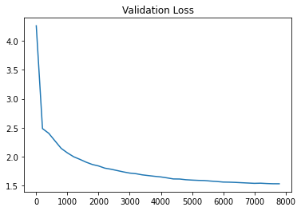
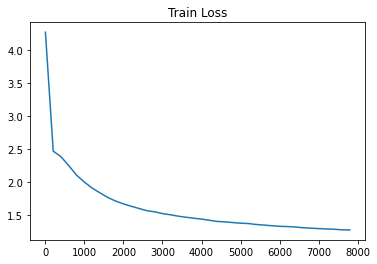

# shakespeare-generator

## Introduction
A decoder only transformer which generates shakespearen gibberish.

My attempt at training a transformer for generating text.

Based on the Bigram Language Model, this decoder-only transformer uses charachter level tokenization, multi-headed attention and layer normalization.

## Training

Then training was done on Google Colaboratory. The jupyter notebook is in the experiments folder.

After an hour long training session the plots for loss vs iterations are as follows:





## Instructions On How To Use

To run the trained model clone this repository, then:
```bash
cd shakespeare-generator
python3 inference.py
```
To train the model, adjust the hyperparameters in hyperparameters.py, then:

```bash
python3 train.py
```


